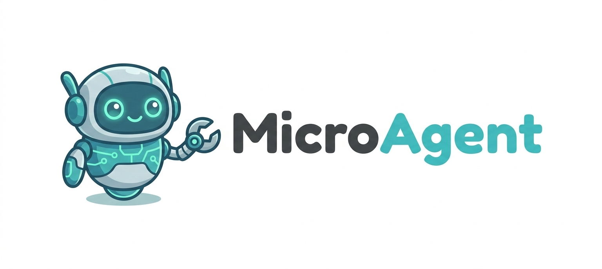

# 🤖 MicroAgent — 超轻量级个人 AI 助手

  

  
  
  
  
  

基于 <strong>Bun + TypeScript</strong> 的超轻量级个人 AI 助手框架，三层架构设计。

<a href="https://jesspig.github.io/micro-agent/">📖 在线文档</a> · <a href="https://jesspig.github.io/micro-agent/guide/changelog/">📦 更新日志</a> · <a href="https://github.com/jesspig/micro-agent/discussions">💬 讨论区</a>

---

> ⚠️ **兼容性声明**：本项目正在快速迭代中，每次较大版本更新时可能会对旧版本不兼容。如果运行失败，可以移除 `~/.micro-agent/` 目录后再进行重启。

---

## 📢 最新更新

- **2026-03-11** ⚠️ **即将进行大规模破坏性重构**
- **2026-03-10** 🏗️ **v0.3.0** — 架构重构
- **2026-03-02** 🚀 **v0.2.2** — 意图识别、知识库、引用溯源
- **2026-02-27** 📦 **v0.2.1** — 项目重命名与代码清理
- **2026-02-24** 🏗️ **v0.2.0** — 架构重构 + 多协议支持