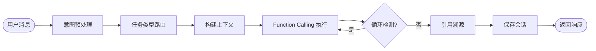
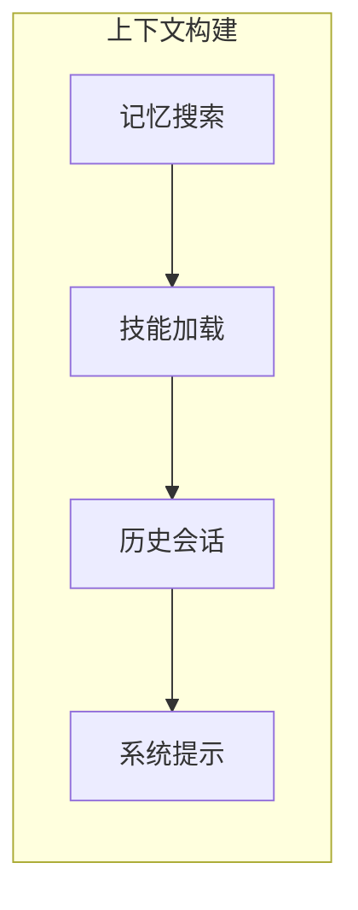
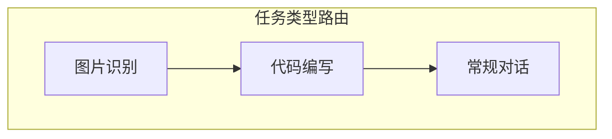
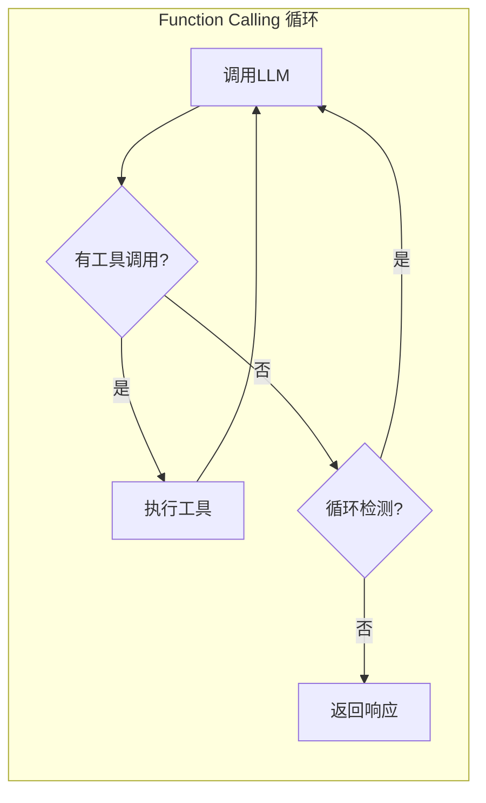

# Agent - 智能代理

## 概述

Agent 核心执行器（AgentExecutor）采用 **Function Calling 模式**，利用主流 LLM 的原生工具调用能力实现 Agent 行为。

同时提供独立的 ReAct Agent 实现（`ReActAgent`），基于 JSON 结构化输出的推理-行动循环。

## 工作流程

### 整体流程



### 上下文构建



### 任务类型识别



### Function Calling 循环



### 循环检测

AgentExecutor 内置三种循环检测模式：

| 模式 | 说明 | 配置 |
|------|------|------|
| 重复检测 | 检测连续相同调用 | `repeat` |
| Ping-Pong 检测 | 检测来回调用同一工具 | `pingPong` |
| 全局熔断 | 累计调用次数超限 | `global` |

## 配置

```typescript
interface AgentConfig {
  workspace: string;
  models?: {
    chat: string;      // 常规对话模型（默认）
    vision?: string;   // 图片识别模型（默认使用 chat）
    coder?: string;    // 编程模型（默认使用 chat）
    intent?: string;   // 意图识别模型（默认使用 chat）
    embed?: string;    // 嵌入模型（用于记忆检索）
  };
  maxIterations: number;
  maxHistoryMessages?: number;  // 消息历史保留数量
  memoryEnabled?: boolean;      // 启用记忆系统
  knowledgeEnabled?: boolean;   // 启用知识库
  citationEnabled?: boolean;    // 启用引用溯源
  loopDetection?: Partial<LoopDetectionConfig>;  // 循环检测配置
}
```

## 上下文构建

Agent 使用 ContextBuilder 构建 LLM 上下文：

1. 加载 always=true 的技能
2. 搜索相关记忆
3. 获取会话历史
4. 合并系统提示

## 任务类型路由

Agent 通过意图识别判断任务类型，选择对应模型：

| 任务类型 | 触发条件 | 使用模型 |
|----------|----------|----------|
| 图片识别 | 用户消息包含图片或请求识别图片 | models.vision（默认 chat）|
| 代码编写 | 用户请求编写、调试、修复代码 | models.coder（默认 chat）|
| 常规对话 | 其他所有情况 | models.chat |

## 源码位置

`packages/runtime/src/executor/`
